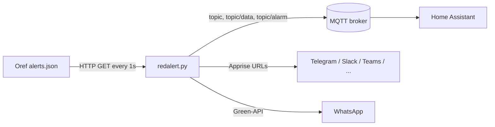

# Red Alert Docker

A small Python service, packaged as a Docker image, that polls the Israeli Home Front Command
(Pikud HaOref) alerts feed from the [Oref website](https://www.oref.org.il/) and publishes active
alerts over MQTT. It is built with [Home Assistant](https://www.home-assistant.io/) in mind, and can
also push alert notifications through [Apprise](https://github.com/caronc/apprise) and WhatsApp
(via [Green-API](https://green-api.com/)).

> [!WARNING]
> **This is not an official alerting system. Do not rely on it for life safety.**
> It is an unofficial hobby project and is **not affiliated with, endorsed by, or connected to the
> Home Front Command (Pikud HaOref)**. Alerts can be delayed, missed, or duplicated because of
> network problems, changes to the Oref website, broker outages, or bugs.
> Always use the official Home Front Command app, the official website, and sirens.

## Table of Contents

- [Features](#features)
- [How it works](#how-it-works)
- [Requirements](#requirements)
- [Installation](#installation)
- [Configuration](#configuration)
- [MQTT topics and payloads](#mqtt-topics-and-payloads)
- [Region filtering and `lamas.json`](#region-filtering-and-lamasjson)
- [Notifications](#notifications)
- [Home Assistant](#home-assistant)
- [Security notes](#security-notes)
- [Troubleshooting](#troubleshooting)
- [Development](#development)
- [Contributing](#contributing)
- [License](#license)

## Features

- Polls `https://www.oref.org.il/WarningMessages/alert/alerts.json` once per second.
- Publishes alert state and the list of alerted locations to an MQTT broker (configurable base topic).
- Optional filter for a single location (`REGION`), or `*` for all alerts.
- Filters out Pikud HaOref test alerts (`בדיקה`, `בדיקה מחזורית`) unless `INCLUDE_TEST_ALERTS=True`.
- De-duplicates alerts by their Oref alert `id`, so each alert is handled once.
- Sends notifications to any [Apprise](https://github.com/caronc/apprise/wiki) channel (Telegram,
  Slack, Microsoft Teams, Home Assistant, IFTTT, and many more).
- Sends WhatsApp messages through Green-API.
- Groups alerted locations by area in notification messages, using `lamas.json` (downloaded from this repository at container start).
- Multi-arch Docker image: `linux/amd64`, `linux/arm64`, `linux/arm/v7`.

## How it works



1. On startup the script connects to the MQTT broker and waits until the connection succeeds.
2. It loads `lamas.json` (see [below](#region-filtering-and-lamasjson)).
3. Every second it fetches the Oref alerts JSON, with these request headers:
   `Referer: https://www.oref.org.il/`, `X-Requested-With: XMLHttpRequest`, and a desktop
   Chrome `User-Agent`.
4. If the response is empty, it publishes the "no alerts" state.
5. If the response contains an alert whose `id` has not been seen before, which matches `REGION`
   (or `REGION=*`), and which is not a test alert, it publishes the alert to MQTT and sends
   notifications.

<!-- TODO: verify: the Oref alerts endpoint is commonly reported to be reachable only from Israeli IP addresses; nothing in the code or its comments confirms this. -->

## Requirements

- Docker (or Python 3 with the packages listed in the [Dockerfile](Dockerfile)).
- An MQTT broker (for example Mosquitto) that accepts username and password authentication.
- Outbound internet access to `www.oref.org.il` and `raw.githubusercontent.com` (for `lamas.json`).
- Optional: Apprise notification URLs, and a Green-API instance for WhatsApp.

## Installation

### Docker image

The image is published to Docker Hub as [`techblog/redalert`](https://hub.docker.com/r/techblog/redalert)
for `linux/amd64`, `linux/arm64` and `linux/arm/v7`. The base image is `ubuntu:20.04`.

A GHCR workflow exists but there is no public image; the newest published tag is 3.5.1 (VERSION says 3.6.1, unpublished).

#### docker run

```bash
docker run -d --name redalert --restart unless-stopped \
  -e MQTT_HOST="broker ip / fqdn" \
  -e MQTT_USER="username" \
  -e MQTT_PASS="password" \
  -e REGION="*" \
  techblog/redalert:latest
```

#### Docker Compose

```yaml
services:
  redalert:
    image: techblog/redalert:latest
    container_name: redalert
    restart: unless-stopped
    environment:
      - MQTT_HOST=[Broker Address]
      - MQTT_USER=[Broker Username]
      - MQTT_PASS=[Broker Password]
      - MQTT_TOPIC=/redalert
      - DEBUG_MODE=False
      - REGION=*                      # * for any, or a single location name
      - NOTIFIERS=                    # space-separated Apprise URLs
      - INCLUDE_TEST_ALERTS=False
      - GREEN_API_INSTANCE=           # optional, WhatsApp via Green-API
      - GREEN_API_TOKEN=
      - WHATSAPP_NUMBER=
```

> [!WARNING]
> The repository's [docker-compose.yaml](docker-compose.yaml) has malformed lines (the unmatched brackets in
> `REGION=[* for any or region name)` and the `GREEN_API_* = #...` entries with spaces around `=`).
> Use the example above instead.

### Build from source

```bash
git clone https://github.com/t0mer/Redalert.git
cd Redalert
docker build -t redalert .
```

## Configuration

All configuration is done with environment variables. The defaults below are the ones set in the
[Dockerfile](Dockerfile). When running `redalert.py` outside Docker, `MQTT_HOST`, `MQTT_PORT`,
`REGION` and `NOTIFIERS` must be set, or the script fails on startup.

| Variable | Default (Docker) | Description |
|---|---|---|
| `MQTT_HOST` | `127.0.0.1` | MQTT broker address (IP or FQDN). |
| `MQTT_PORT` | `1883` | MQTT broker port. **Note:** the value is read but not currently passed to the MQTT client, which always connects on port `1883`. |
| `MQTT_USER` | `user` | MQTT username. |
| `MQTT_PASS` | `password` | MQTT password. |
| `MQTT_TOPIC` | `/redalert` | Base MQTT topic. See [MQTT topics](#mqtt-topics-and-payloads). |
| `REGION` | `*` | `*` for all alerts, or one location name exactly as it appears in the Oref feed (for example `תל אביב - מרכז העיר`). |
| `INCLUDE_TEST_ALERTS` | `False` | Test alerts are skipped only when this is exactly `False`. Any other value includes them. |
| `DEBUG_MODE` | `False` | When `True`, the script polls `http://localhost/alerts.json` instead of the Oref website, for testing. |
| `NOTIFIERS` | *(empty)* | Space-separated list of [Apprise](https://github.com/caronc/apprise/wiki) URLs. |
| `GREEN_API_INSTANCE` | *(empty)* | Green-API instance ID. WhatsApp is used only when both this and `GREEN_API_TOKEN` are set. |
| `GREEN_API_TOKEN` | *(empty)* | Green-API API token. |
| `WHATSAPP_NUMBER` | *(empty)* | Full WhatsApp chatId that receives the message, for example `972501234567@c.us` (or `…@g.us` for a group). |

## MQTT topics and payloads

With the default `MQTT_TOPIC=/redalert`. All messages use QoS 0 and are **not retained**.

| Topic | Payload | When |
|---|---|---|
| `/redalert` | `on` | A new, matching alert is received. |
| `/redalert` | `No active alerts` | Every poll (once per second) when the Oref feed is empty. |
| `/redalert/data` | List of alerted locations, for example `['שדרות', 'ניר עם']` | Together with `on`. |
| `/redalert/alarm` | `off` | Every poll when the Oref feed is empty. |

Notes:

- `/redalert/data` is the Python string form of the list (single quotes), **not valid JSON**.
- `/redalert/alarm` currently only ever receives `off`; the `on` state is published to the base topic.
- The client ID is fixed (`redalert`), so run only one instance per broker.
- Nothing is published while an alert for a different location (not matching `REGION`) is active.

## Region filtering and `lamas.json`

`REGION` is compared with the alert's `data` list by exact match, so it must be a single location
name written exactly like Pikud HaOref writes it (Hebrew). Use `*` to receive every alert.

`lamas.json` is **not** used for filtering. It maps areas to locations and is only used to group
the locations in Apprise and WhatsApp messages. Its format is:

```json
{
  "areas": {
    "אילת": {
      "אזור תעשייה שחורת": {},
      "אילות": {},
      "אילת": {}
    }
  }
}
```

Locations that are not found in the file are grouped under `כללי`. The script reads `lamas.json`
from its working directory, and downloads it from this repository's `master` branch
(`raw.githubusercontent.com`) if the file is missing or invalid.

The Docker image does **not** bundle `lamas.json`: the Dockerfile copies only `redalert.py` and
sets no `WORKDIR`, so every container start downloads the file into `/`. If that download fails,
the script crashes at startup with a `TypeError` (and the restart policy restarts it).

## Notifications

### Apprise

Thanks to the amazing work of [@caronc](https://github.com/caronc) on
[Apprise](https://github.com/caronc/apprise) (added in the 18/05/2021 update), you can send
notifications through a variety of channels, for example:

* Telegram - [tgram://bottoken/ChatID](https://github.com/caronc/apprise/wiki/Notify_telegram)
* Home Assistant - [hassio://user@hostname/accesstoken](https://github.com/caronc/apprise/wiki/Notify_homeassistant)
* IFTTT - [ifttt://{WebhookID}@{Event}/](https://github.com/caronc/apprise/wiki/Notify_ifttt)
* Slack - [slack://TokenA/TokenB/TokenC/Channel](https://github.com/caronc/apprise/wiki/Notify_slack)
* Microsoft Teams - [msteams://TokenA/TokenB/TokenC/](https://github.com/caronc/apprise/wiki/Notify_msteams)

And much more; see the Apprise [wiki](https://github.com/caronc/apprise/wiki). Set several
notifiers in `NOTIFIERS`, separated by spaces:

```text
tgram://bottoken/ChatID hassio://user@hostname/accesstoken slack://TokenA/TokenB/TokenC/Channel
```

The notification title is the alert title from Oref, and the body lists the alerted locations
grouped by area (`באזורים הבאים:`).

### WhatsApp (Green-API)

Set `GREEN_API_INSTANCE`, `GREEN_API_TOKEN` and `WHATSAPP_NUMBER` to also receive the same message
on WhatsApp through [Green-API](https://green-api.com/). Exceptions are logged; Green-API error
responses are not checked.

## Home Assistant

The examples below use the modern `mqtt:` YAML format and the default `/redalert` topic. Because
messages are not retained, the entities stay `unknown` until the first message arrives after a
Home Assistant restart (the "no alerts" state is published every second, so this is short).

```yaml
mqtt:
  binary_sensor:
    - name: "Red Alert"
      state_topic: "/redalert"
      payload_on: "on"
      payload_off: "No active alerts"
      device_class: safety

  sensor:
    - name: "Red Alert State"
      state_topic: "/redalert"
      icon: mdi:broadcast

    - name: "Red Alert Locations"
      state_topic: "/redalert/data"
      icon: mdi:map-marker-alert
      # Home Assistant states are limited to 255 characters
      value_template: "{{ value[:255] }}"
```

Example automation:

```yaml
automation:
  - alias: "Red Alert notification"
    triggers:
      - trigger: state
        entity_id: binary_sensor.red_alert
        to: "on"
    actions:
      - action: notify.notify
        data:
          title: "Red Alert"
          message: "{{ states('sensor.red_alert_locations') }}"
```

## Security notes

- **MQTT credentials** are passed as plain environment variables. Don't commit them; use an
  `.env` file (only environment variables are read; there is no `*_FILE` support), and give the MQTT user access to the Red Alert topics only.
- **No TLS:** the MQTT client connects without TLS, so credentials and messages are sent in clear
  text. Keep the broker on a trusted network, or put it behind a TLS-terminating proxy or tunnel.
- Apprise URLs and Green-API tokens contain secrets. Treat `NOTIFIERS` and `GREEN_API_TOKEN` like
  passwords.
- The container runs as root.

## Troubleshooting

- **`Connection refused – bad username or password`** in the log: check `MQTT_USER` and `MQTT_PASS`.
- **Stuck in `In wait loop`:** the broker refused the connection (CONNACK code other than 0, for
  example bad credentials); look for the `Connection refused` log line. If the broker is unreachable
  on `MQTT_HOST` port `1883`, `connect()` raises, the script exits and the restart policy restarts it.
- **No alerts for your city:** `REGION` must match the location name in the Oref feed exactly.
  Try `REGION=*` first.
- **Home Assistant JSON template errors:** `/redalert` and `/redalert/data` are not JSON; don't
  use `value_json` with them.

Logs are written to the container's standard error by [loguru](https://github.com/Delgan/loguru):

```bash
docker logs -f redalert
```

## Development

```text
redalert.py          # the service
lamas.json           # area -> locations map used to group notification text
Dockerfile           # ubuntu:20.04 + pip packages
docker-compose.yaml  # example Compose file
VERSION              # image version used by the release and Docker workflows
.github/workflows/   # Docker Hub build, GHCR publish, release, SonarCloud
```

Run locally without Docker:

```bash
pip3 install paho-mqtt==1.6.1 urllib3 loguru requests apprise websocket-client whatsapp-api-client-python
export MQTT_HOST=127.0.0.1 MQTT_PORT=1883 MQTT_USER=user MQTT_PASS=password REGION='*' NOTIFIERS='' INCLUDE_TEST_ALERTS=False
python3 redalert.py
```

To test without real alerts, set `DEBUG_MODE=True` and serve a sample `alerts.json` at
`http://localhost/alerts.json`.

Releases: the **Docker Build** workflow pushes `techblog/redalert:latest` and
`techblog/redalert:<VERSION>`. Recent images were published by running it manually; GitHub
Releases stop at 2.1.0, so use the [Docker Hub tags](https://hub.docker.com/r/techblog/redalert/tags)
to find versions.

## Contributing

Issues and pull requests are welcome at [t0mer/Redalert](https://github.com/t0mer/Redalert).

## License

This project is licensed under the [Apache License 2.0](LICENSE).
